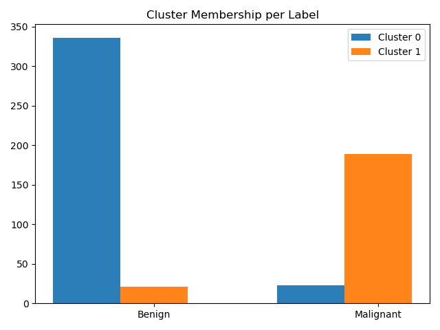

Expectation-Maximization from scratch

## Dataset:
Wisconsin Breast Cancer Dataset:  

https://archive.ics.uci.edu/ml/datasets/Breast+Cancer+Wisconsin+(Diagnostic)  

## Purpose
Gain familiarity with the algorithm by developing it from scratch.  
Hence, best ML practices such as train/test/cross-validation splits 
are NOT prioritized.

## Run
python Runner.py

## Implementation
As described in the Youtube Video lectures by Victor Lavrenko:  
https://www.youtube.com/playlist?list=PLBv09BD7ez_7beI0_fuE96lSbsr_8K8YD 

## Config  
K = 2  

## Results  
Most Benign records get assigned to their own cluster
Most Malignant records also end up in their own cluster
Benign records tend to cluster better than Malignant

## Results

Overall Accuracy: 0.922

| Class         | Labeled       | Predicted|
|:-------------:|:-------------:|:-------------:|
| Malignant     | 212           | 210           |
| Benign        | 357           | 359           |

| Class         | True Positive | False Positive|
|:-------------:|:-------------:|:-------------:|
| Malignant     | 189           | 21             |
| Benign        | 336           | 23            |

| Class         | Precision     | Recall| F1 Score |
|:-------------:|:-------------:|:-----:|:--------:|
| Malignant     | 0.9        | 0.892 | 0.896    |
| Benign        | 0.936         | 0.941 | 0.938    |

Number of misclassified records: 44/569

|Record ID|Label|Probability Class0|Probability Class 1|Prediction Error |
|:-------:|:---:|:---:|:---:|:--------------------:|
|842302|Malignant|0.0|1.0|0.0|
|842517|Malignant|0.0|1.0|0.0|
|84300903|Malignant|0.0|1.0|0.0|
|84348301|Malignant|0.0|1.0|0.0|
|84358402|Malignant|0.0|1.0|0.0|
|843786|Malignant|0.0|1.0|0.0|
|844359|Malignant|0.0|1.0|0.0|
|84458202|Malignant|0.002|0.998|0.0|
|844981|Malignant|0.0|1.0|0.0|
|84501001|Malignant|0.0|1.0|0.0|
|845636|Malignant|0.787|0.213|1.0|
|84610002|Malignant|0.0|1.0|0.0|
|846226|Malignant|0.5|0.5|0.0|
|846381|Malignant|0.991|0.009|1.0|
|84667401|Malignant|0.0|1.0|0.0|
|84799002|Malignant|0.0|1.0|0.0|
|848406|Malignant|0.0|1.0|0.0|
|84862001|Malignant|0.0|1.0|0.0|
|849014|Malignant|0.0|1.0|0.0|
|8510426|Benign|1.0|0.0|0.0|
|8510653|Benign|1.0|0.0|0.0|
|8510824|Benign|1.0|0.0|0.0|
|8511133|Malignant|0.0|1.0|0.0|
|851509|Malignant|0.0|1.0|0.0|
|852552|Malignant|0.0|1.0|0.0|
|852631|Malignant|0.0|1.0|0.0|
|852763|Malignant|0.0|1.0|0.0|
|852781|Malignant|0.0|1.0|0.0|
|852973|Malignant|0.0|1.0|0.0|
|853201|Malignant|0.0|1.0|0.0|
|853401|Malignant|0.0|1.0|0.0|
|853612|Malignant|0.0|1.0|0.0|
|85382601|Malignant|0.0|1.0|0.0|
|854002|Malignant|0.0|1.0|0.0|
|854039|Malignant|0.0|1.0|0.0|
|854253|Malignant|0.0|1.0|0.0|
|854268|Malignant|0.0|1.0|0.0|
|854941|Benign|1.0|0.0|0.0|
|855133|Malignant|0.5|0.5|0.0|
|855138|Malignant|0.0|1.0|0.0|
|855167|Malignant|1.0|0.0|1.0|
|855563|Malignant|0.052|0.948|0.0|
|855625|Malignant|0.0|1.0|0.0|
|856106|Malignant|0.0|1.0|0.0|
|85638502|Malignant|0.0|1.0|0.0|
|857010|Malignant|0.0|1.0|0.0|
|85713702|Benign|1.0|0.0|0.0|
|85715|Malignant|0.0|1.0|0.0|
|857155|Benign|1.0|0.0|0.0|
|857156|Benign|1.0|0.0|0.0|
|857343|Benign|1.0|0.0|0.0|
|857373|Benign|1.0|0.0|0.0|
|857374|Benign|1.0|0.0|0.0|
|857392|Malignant|0.0|1.0|0.0|
|857438|Malignant|0.236|0.764|0.0|
|85759902|Benign|1.0|0.0|0.0|
|857637|Malignant|0.0|1.0|0.0|
|857793|Malignant|0.0|1.0|0.0|
|857810|Benign|1.0|0.0|0.0|
|858477|Benign|1.0|0.0|0.0|
|858970|Benign|1.0|0.0|0.0|
|858981|Benign|1.0|0.0|0.0|
|858986|Malignant|0.0|1.0|0.0|
|859196|Benign|1.0|0.0|0.0|
|85922302|Malignant|0.0|1.0|0.0|
|859283|Malignant|0.0|1.0|0.0|
|859464|Benign|1.0|0.0|0.0|
|859465|Benign|1.0|0.0|0.0|
|859471|Benign|0.5|0.5|1.0|
|859487|Benign|1.0|0.0|0.0|
|859575|Malignant|0.0|1.0|0.0|
|859711|Benign|0.5|0.5|1.0|
|859717|Malignant|0.0|1.0|0.0|
|859983|Malignant|0.035|0.965|0.0|
|8610175|Benign|1.0|0.0|0.0|
|8610404|Malignant|0.693|0.307|1.0|
|8610629|Benign|1.0|0.0|0.0|
|8610637|Malignant|0.0|1.0|0.0|
|8610862|Malignant|0.5|0.5|0.0|
|8610908|Benign|1.0|0.0|0.0|
|861103|Benign|1.0|0.0|0.0|
|8611161|Benign|0.0|1.0|1.0|
|8611555|Malignant|0.0|1.0|0.0|
|8611792|Malignant|0.0|1.0|0.0|
|8612080|Benign|1.0|0.0|0.0|
|8612399|Malignant|0.0|1.0|0.0|
|86135501|Malignant|0.999|0.001|1.0|
|86135502|Malignant|0.0|1.0|0.0|
|861597|Benign|1.0|0.0|0.0|
|861598|Benign|1.0|0.0|0.0|
|861648|Benign|1.0|0.0|0.0|
|861799|Malignant|1.0|0.0|1.0|
|861853|Benign|1.0|0.0|0.0|
|862009|Benign|1.0|0.0|0.0|
|862028|Malignant|0.0|1.0|0.0|
|86208|Malignant|0.0|1.0|0.0|
|86211|Benign|1.0|0.0|0.0|
|862261|Benign|1.0|0.0|0.0|
|862485|Benign|1.0|0.0|0.0|
|862548|Malignant|0.999|0.001|1.0|
|862717|Malignant|0.858|0.142|1.0|
|862722|Benign|1.0|0.0|0.0|
|862965|Benign|1.0|0.0|0.0|
|862980|Benign|1.0|0.0|0.0|
|862989|Benign|1.0|0.0|0.0|
|863030|Malignant|0.0|1.0|0.0|
|863031|Benign|1.0|0.0|0.0|
|863270|Benign|1.0|0.0|0.0|
|86355|Malignant|0.0|1.0|0.0|
|864018|Benign|1.0|0.0|0.0|
|864033|Benign|1.0|0.0|0.0|
|86408|Benign|1.0|0.0|0.0|
|86409|Benign|0.0|1.0|1.0|
|864292|Benign|1.0|0.0|0.0|
|864496|Benign|1.0|0.0|0.0|
|864685|Benign|1.0|0.0|0.0|
|864726|Benign|1.0|0.0|0.0|
|864729|Malignant|0.0|1.0|0.0|
|864877|Malignant|0.0|1.0|0.0|
|865128|Malignant|0.0|1.0|0.0|
|865137|Benign|1.0|0.0|0.0|
|86517|Malignant|0.0|1.0|0.0|
|865423|Malignant|0.5|0.5|0.0|
|865432|Benign|1.0|0.0|0.0|
|865468|Benign|1.0|0.0|0.0|
|86561|Benign|1.0|0.0|0.0|
|866083|Malignant|0.0|1.0|0.0|
|866203|Malignant|0.0|1.0|0.0|
|866458|Benign|1.0|0.0|0.0|
|866674|Malignant|0.0|1.0|0.0|
|866714|Benign|1.0|0.0|0.0|
|8670|Malignant|0.0|1.0|0.0|
|86730502|Malignant|0.996|0.004|1.0|
|867387|Benign|0.999|0.001|0.0|
|867739|Malignant|0.0|1.0|0.0|
|868202|Malignant|1.0|0.0|1.0|
|868223|Benign|1.0|0.0|0.0|
|868682|Benign|1.0|0.0|0.0|
|868826|Malignant|0.0|1.0|0.0|
|868871|Benign|1.0|0.0|0.0|
|868999|Benign|1.0|0.0|0.0|
|869104|Malignant|0.623|0.377|1.0|
|869218|Benign|1.0|0.0|0.0|
|869224|Benign|1.0|0.0|0.0|
|869254|Benign|1.0|0.0|0.0|
|869476|Benign|1.0|0.0|0.0|
|869691|Malignant|0.0|1.0|0.0|
|86973701|Benign|1.0|0.0|0.0|
|86973702|Benign|0.988|0.012|0.0|
|869931|Benign|1.0|0.0|0.0|
|871001501|Benign|1.0|0.0|0.0|
|871001502|Benign|1.0|0.0|0.0|
|8710441|Benign|0.5|0.5|1.0|
|87106|Benign|1.0|0.0|0.0|
|8711002|Benign|0.993|0.007|0.0|
|8711003|Benign|1.0|0.0|0.0|
|8711202|Malignant|0.0|1.0|0.0|
|8711216|Benign|0.002|0.998|1.0|
|871122|Benign|1.0|0.0|0.0|
|871149|Benign|1.0|0.0|0.0|
|8711561|Benign|1.0|0.0|0.0|
|8711803|Malignant|0.0|1.0|0.0|
|871201|Malignant|0.0|1.0|0.0|
|8712064|Benign|1.0|0.0|0.0|
|8712289|Malignant|0.0|1.0|0.0|
|8712291|Benign|1.0|0.0|0.0|
|87127|Benign|1.0|0.0|0.0|
|8712729|Malignant|0.953|0.047|1.0|
|8712766|Malignant|0.0|1.0|0.0|
|8712853|Benign|1.0|0.0|0.0|
|87139402|Benign|1.0|0.0|0.0|
|87163|Malignant|0.0|1.0|0.0|
|87164|Malignant|0.0|1.0|0.0|
|871641|Benign|1.0|0.0|0.0|
|871642|Benign|1.0|0.0|0.0|
|872113|Benign|1.0|0.0|0.0|
|872608|Benign|0.996|0.004|0.0|
|87281702|Malignant|0.0|1.0|0.0|
|873357|Benign|1.0|0.0|0.0|
|873586|Benign|1.0|0.0|0.0|
|873592|Malignant|0.0|1.0|0.0|
|873593|Malignant|0.0|1.0|0.0|
|873701|Malignant|0.0|1.0|0.0|
|873843|Benign|1.0|0.0|0.0|
|873885|Malignant|0.049|0.951|0.0|
|874158|Benign|1.0|0.0|0.0|
|874217|Malignant|0.0|1.0|0.0|
|874373|Benign|1.0|0.0|0.0|
|874662|Benign|1.0|0.0|0.0|
|874839|Benign|1.0|0.0|0.0|
|874858|Malignant|0.0|1.0|0.0|
|875093|Benign|1.0|0.0|0.0|
|875099|Benign|0.5|0.5|1.0|
|875263|Malignant|0.0|1.0|0.0|
|87556202|Malignant|0.0|1.0|0.0|
|875878|Benign|1.0|0.0|0.0|
|875938|Malignant|0.0|1.0|0.0|
|877159|Malignant|0.0|1.0|0.0|
|877486|Malignant|0.0|1.0|0.0|
|877500|Malignant|0.0|1.0|0.0|
|877501|Benign|1.0|0.0|0.0|
|877989|Malignant|0.0|1.0|0.0|
|878796|Malignant|0.0|1.0|0.0|
|87880|Malignant|0.0|1.0|0.0|
|87930|Benign|0.999|0.001|0.0|
|879523|Malignant|0.987|0.013|1.0|
|879804|Benign|1.0|0.0|0.0|
|879830|Malignant|0.981|0.019|1.0|
|8810158|Benign|0.0|1.0|1.0|
|8810436|Benign|1.0|0.0|0.0|
|881046502|Malignant|0.0|1.0|0.0|
|8810528|Benign|1.0|0.0|0.0|
|8810703|Malignant|0.5|0.5|0.0|
|881094802|Malignant|0.5|0.5|0.0|
|8810955|Malignant|0.0|1.0|0.0|
|8810987|Malignant|0.899|0.101|1.0|
|8811523|Benign|0.999|0.001|0.0|
|8811779|Benign|1.0|0.0|0.0|
|8811842|Malignant|0.0|1.0|0.0|
|88119002|Malignant|0.0|1.0|0.0|
|8812816|Benign|1.0|0.0|0.0|
|8812818|Benign|1.0|0.0|0.0|
|8812844|Benign|1.0|0.0|0.0|
|8812877|Malignant|0.0|1.0|0.0|
|8813129|Benign|1.0|0.0|0.0|
|88143502|Benign|1.0|0.0|0.0|
|88147101|Benign|1.0|0.0|0.0|
|88147102|Benign|0.019|0.981|1.0|
|88147202|Benign|0.054|0.946|1.0|
|881861|Malignant|0.0|1.0|0.0|
|881972|Malignant|0.0|1.0|0.0|
|88199202|Benign|1.0|0.0|0.0|
|88203002|Benign|1.0|0.0|0.0|
|88206102|Malignant|0.0|1.0|0.0|
|882488|Benign|1.0|0.0|0.0|
|88249602|Benign|1.0|0.0|0.0|
|88299702|Malignant|0.0|1.0|0.0|
|883263|Malignant|0.0|1.0|0.0|
|883270|Benign|1.0|0.0|0.0|
|88330202|Malignant|0.0|1.0|0.0|
|88350402|Benign|1.0|0.0|0.0|
|883539|Benign|1.0|0.0|0.0|
|883852|Benign|0.0|1.0|1.0|
|88411702|Benign|1.0|0.0|0.0|
|884180|Malignant|0.0|1.0|0.0|
|884437|Benign|1.0|0.0|0.0|
|884448|Benign|1.0|0.0|0.0|
|884626|Benign|0.0|1.0|1.0|
|88466802|Benign|1.0|0.0|0.0|
|884689|Benign|1.0|0.0|0.0|
|884948|Malignant|0.0|1.0|0.0|
|88518501|Benign|1.0|0.0|0.0|
|885429|Malignant|0.0|1.0|0.0|
|8860702|Malignant|0.0|1.0|0.0|
|886226|Malignant|0.0|1.0|0.0|
|886452|Malignant|1.0|0.0|1.0|
|88649001|Malignant|0.0|1.0|0.0|
|886776|Malignant|0.0|1.0|0.0|
|887181|Malignant|0.0|1.0|0.0|
|88725602|Malignant|0.0|1.0|0.0|
|887549|Malignant|0.0|1.0|0.0|
|888264|Malignant|0.0|1.0|0.0|
|888570|Malignant|0.0|1.0|0.0|
|889403|Malignant|1.0|0.0|1.0|
|889719|Malignant|0.0|1.0|0.0|
|88995002|Malignant|0.0|1.0|0.0|
|8910251|Benign|1.0|0.0|0.0|
|8910499|Benign|1.0|0.0|0.0|
|8910506|Benign|1.0|0.0|0.0|
|8910720|Benign|1.0|0.0|0.0|
|8910721|Benign|1.0|0.0|0.0|
|8910748|Benign|1.0|0.0|0.0|
|8910988|Malignant|0.0|1.0|0.0|
|8910996|Benign|1.0|0.0|0.0|
|8911163|Malignant|0.0|1.0|0.0|
|8911164|Benign|1.0|0.0|0.0|
|8911230|Benign|1.0|0.0|0.0|
|8911670|Malignant|0.0|1.0|0.0|
|8911800|Benign|1.0|0.0|0.0|
|8911834|Benign|1.0|0.0|0.0|
|8912049|Malignant|0.0|1.0|0.0|
|8912055|Benign|1.0|0.0|0.0|
|89122|Malignant|0.0|1.0|0.0|
|8912280|Malignant|0.0|1.0|0.0|
|8912284|Benign|1.0|0.0|0.0|
|8912521|Benign|1.0|0.0|0.0|
|8912909|Benign|0.997|0.003|0.0|
|8913|Benign|1.0|0.0|0.0|
|8913049|Benign|0.5|0.5|1.0|
|89143601|Benign|1.0|0.0|0.0|
|89143602|Benign|0.5|0.5|1.0|
|8915|Benign|0.042|0.958|1.0|
|891670|Benign|0.999|0.001|0.0|
|891703|Benign|1.0|0.0|0.0|
|891716|Benign|1.0|0.0|0.0|
|891923|Benign|1.0|0.0|0.0|
|891936|Benign|1.0|0.0|0.0|
|892189|Malignant|1.0|0.0|1.0|
|892214|Benign|1.0|0.0|0.0|
|892399|Benign|1.0|0.0|0.0|
|892438|Malignant|0.0|1.0|0.0|
|892604|Benign|1.0|0.0|0.0|
|89263202|Malignant|0.0|1.0|0.0|
|892657|Benign|1.0|0.0|0.0|
|89296|Benign|1.0|0.0|0.0|
|893061|Benign|1.0|0.0|0.0|
|89344|Benign|1.0|0.0|0.0|
|89346|Benign|1.0|0.0|0.0|
|893526|Benign|1.0|0.0|0.0|
|893548|Benign|1.0|0.0|0.0|
|893783|Benign|1.0|0.0|0.0|
|89382601|Benign|1.0|0.0|0.0|
|89382602|Benign|1.0|0.0|0.0|
|893988|Benign|1.0|0.0|0.0|
|894047|Benign|1.0|0.0|0.0|
|894089|Benign|1.0|0.0|0.0|
|894090|Benign|1.0|0.0|0.0|
|894326|Malignant|0.0|1.0|0.0|
|894329|Benign|0.999|0.001|0.0|
|894335|Benign|1.0|0.0|0.0|
|894604|Benign|1.0|0.0|0.0|
|894618|Malignant|0.0|1.0|0.0|
|894855|Benign|1.0|0.0|0.0|
|895100|Malignant|0.0|1.0|0.0|
|89511501|Benign|1.0|0.0|0.0|
|89511502|Benign|1.0|0.0|0.0|
|89524|Benign|1.0|0.0|0.0|
|895299|Benign|1.0|0.0|0.0|
|8953902|Malignant|0.0|1.0|0.0|
|895633|Malignant|0.0|1.0|0.0|
|896839|Malignant|0.001|0.999|0.0|
|896864|Benign|0.997|0.003|0.0|
|897132|Benign|1.0|0.0|0.0|
|897137|Benign|1.0|0.0|0.0|
|897374|Benign|1.0|0.0|0.0|
|89742801|Malignant|0.0|1.0|0.0|
|897604|Benign|1.0|0.0|0.0|
|897630|Malignant|0.0|1.0|0.0|
|897880|Benign|1.0|0.0|0.0|
|89812|Malignant|0.0|1.0|0.0|
|89813|Benign|1.0|0.0|0.0|
|898143|Benign|1.0|0.0|0.0|
|89827|Benign|1.0|0.0|0.0|
|898431|Malignant|0.0|1.0|0.0|
|89864002|Benign|1.0|0.0|0.0|
|898677|Benign|1.0|0.0|0.0|
|898678|Benign|1.0|0.0|0.0|
|89869|Benign|0.845|0.155|0.0|
|898690|Benign|1.0|0.0|0.0|
|899147|Benign|1.0|0.0|0.0|
|899187|Benign|1.0|0.0|0.0|
|899667|Malignant|0.0|1.0|0.0|
|899987|Malignant|0.0|1.0|0.0|
|9010018|Malignant|0.0|1.0|0.0|
|901011|Benign|1.0|0.0|0.0|
|9010258|Benign|1.0|0.0|0.0|
|9010259|Benign|1.0|0.0|0.0|
|901028|Benign|1.0|0.0|0.0|
|9010333|Benign|1.0|0.0|0.0|
|901034301|Benign|1.0|0.0|0.0|
|901034302|Benign|1.0|0.0|0.0|
|901041|Benign|1.0|0.0|0.0|
|9010598|Benign|1.0|0.0|0.0|
|9010872|Benign|0.955|0.045|0.0|
|9010877|Benign|1.0|0.0|0.0|
|901088|Malignant|0.0|1.0|0.0|
|9011494|Malignant|0.0|1.0|0.0|
|9011495|Benign|1.0|0.0|0.0|
|9011971|Malignant|0.0|1.0|0.0|
|9012000|Malignant|0.0|1.0|0.0|
|9012315|Malignant|0.0|1.0|0.0|
|9012568|Benign|1.0|0.0|0.0|
|9012795|Malignant|0.0|1.0|0.0|
|901288|Malignant|0.0|1.0|0.0|
|9013005|Benign|1.0|0.0|0.0|
|901303|Benign|0.983|0.017|0.0|
|901315|Benign|1.0|0.0|0.0|
|9013579|Benign|1.0|0.0|0.0|
|9013594|Benign|1.0|0.0|0.0|
|9013838|Malignant|0.0|1.0|0.0|
|901549|Benign|1.0|0.0|0.0|
|901836|Benign|1.0|0.0|0.0|
|90250|Benign|1.0|0.0|0.0|
|90251|Benign|0.998|0.002|0.0|
|902727|Benign|0.999|0.001|0.0|
|90291|Malignant|0.999|0.001|1.0|
|902975|Benign|1.0|0.0|0.0|
|902976|Benign|1.0|0.0|0.0|
|903011|Benign|1.0|0.0|0.0|
|90312|Malignant|0.0|1.0|0.0|
|90317302|Benign|1.0|0.0|0.0|
|903483|Benign|1.0|0.0|0.0|
|903507|Malignant|0.0|1.0|0.0|
|903516|Malignant|0.0|1.0|0.0|
|903554|Benign|1.0|0.0|0.0|
|903811|Benign|1.0|0.0|0.0|
|90401601|Benign|1.0|0.0|0.0|
|90401602|Benign|1.0|0.0|0.0|
|904302|Benign|1.0|0.0|0.0|
|904357|Benign|1.0|0.0|0.0|
|90439701|Malignant|0.0|1.0|0.0|
|904647|Benign|1.0|0.0|0.0|
|904689|Benign|1.0|0.0|0.0|
|9047|Benign|1.0|0.0|0.0|
|904969|Benign|1.0|0.0|0.0|
|904971|Benign|1.0|0.0|0.0|
|905189|Benign|0.99|0.01|0.0|
|905190|Benign|1.0|0.0|0.0|
|90524101|Malignant|0.0|1.0|0.0|
|905501|Benign|1.0|0.0|0.0|
|905502|Benign|1.0|0.0|0.0|
|905520|Benign|1.0|0.0|0.0|
|905539|Benign|1.0|0.0|0.0|
|905557|Benign|0.874|0.126|0.0|
|905680|Malignant|1.0|0.0|1.0|
|905686|Benign|1.0|0.0|0.0|
|905978|Benign|1.0|0.0|0.0|
|90602302|Malignant|0.0|1.0|0.0|
|906024|Benign|1.0|0.0|0.0|
|906290|Benign|1.0|0.0|0.0|
|906539|Benign|1.0|0.0|0.0|
|906564|Benign|0.983|0.017|0.0|
|906616|Benign|1.0|0.0|0.0|
|906878|Benign|1.0|0.0|0.0|
|907145|Benign|1.0|0.0|0.0|
|907367|Benign|1.0|0.0|0.0|
|907409|Benign|1.0|0.0|0.0|
|90745|Benign|1.0|0.0|0.0|
|90769601|Benign|1.0|0.0|0.0|
|90769602|Benign|1.0|0.0|0.0|
|907914|Malignant|0.0|1.0|0.0|
|907915|Benign|1.0|0.0|0.0|
|908194|Malignant|0.0|1.0|0.0|
|908445|Malignant|0.0|1.0|0.0|
|908469|Benign|1.0|0.0|0.0|
|908489|Malignant|0.001|0.999|0.0|
|908916|Benign|1.0|0.0|0.0|
|909220|Benign|1.0|0.0|0.0|
|909231|Benign|1.0|0.0|0.0|
|909410|Benign|1.0|0.0|0.0|
|909411|Benign|0.0|1.0|1.0|
|909445|Malignant|0.0|1.0|0.0|
|90944601|Benign|1.0|0.0|0.0|
|909777|Benign|1.0|0.0|0.0|
|9110127|Malignant|0.0|1.0|0.0|
|9110720|Benign|1.0|0.0|0.0|
|9110732|Malignant|0.0|1.0|0.0|
|9110944|Benign|1.0|0.0|0.0|
|911150|Benign|0.998|0.002|0.0|
|911157302|Malignant|0.0|1.0|0.0|
|9111596|Benign|1.0|0.0|0.0|
|9111805|Malignant|0.0|1.0|0.0|
|9111843|Benign|1.0|0.0|0.0|
|911201|Benign|1.0|0.0|0.0|
|911202|Benign|1.0|0.0|0.0|
|9112085|Benign|1.0|0.0|0.0|
|9112366|Benign|1.0|0.0|0.0|
|9112367|Benign|1.0|0.0|0.0|
|9112594|Benign|1.0|0.0|0.0|
|9112712|Benign|1.0|0.0|0.0|
|911296201|Malignant|0.0|1.0|0.0|
|911296202|Malignant|0.5|0.5|0.0|
|9113156|Benign|1.0|0.0|0.0|
|911320501|Benign|1.0|0.0|0.0|
|911320502|Benign|1.0|0.0|0.0|
|9113239|Benign|0.0|1.0|1.0|
|9113455|Benign|0.132|0.868|1.0|
|9113514|Benign|1.0|0.0|0.0|
|9113538|Malignant|0.0|1.0|0.0|
|911366|Benign|1.0|0.0|0.0|
|9113778|Benign|1.0|0.0|0.0|
|9113816|Benign|1.0|0.0|0.0|
|911384|Benign|0.999|0.001|0.0|
|9113846|Benign|1.0|0.0|0.0|
|911391|Benign|1.0|0.0|0.0|
|911408|Benign|0.999|0.001|0.0|
|911654|Benign|0.987|0.013|0.0|
|911673|Benign|1.0|0.0|0.0|
|911685|Benign|1.0|0.0|0.0|
|911916|Malignant|0.0|1.0|0.0|
|912193|Benign|1.0|0.0|0.0|
|91227|Benign|1.0|0.0|0.0|
|912519|Benign|0.966|0.034|0.0|
|912558|Benign|1.0|0.0|0.0|
|912600|Benign|0.996|0.004|0.0|
|913063|Benign|0.985|0.015|0.0|
|913102|Benign|1.0|0.0|0.0|
|913505|Malignant|0.0|1.0|0.0|
|913512|Benign|1.0|0.0|0.0|
|913535|Malignant|0.0|1.0|0.0|
|91376701|Benign|1.0|0.0|0.0|
|91376702|Benign|0.0|1.0|1.0|
|914062|Malignant|0.833|0.167|1.0|
|914101|Benign|1.0|0.0|0.0|
|914102|Benign|1.0|0.0|0.0|
|914333|Benign|1.0|0.0|0.0|
|914366|Benign|0.999|0.001|0.0|
|914580|Benign|1.0|0.0|0.0|
|914769|Malignant|0.0|1.0|0.0|
|91485|Malignant|0.0|1.0|0.0|
|914862|Benign|1.0|0.0|0.0|
|91504|Malignant|0.0|1.0|0.0|
|91505|Benign|1.0|0.0|0.0|
|915143|Malignant|0.0|1.0|0.0|
|915186|Benign|1.0|0.0|0.0|
|915276|Benign|1.0|0.0|0.0|
|91544001|Benign|1.0|0.0|0.0|
|91544002|Benign|1.0|0.0|0.0|
|915452|Benign|0.006|0.994|1.0|
|915460|Malignant|0.0|1.0|0.0|
|91550|Benign|1.0|0.0|0.0|
|915664|Benign|1.0|0.0|0.0|
|915691|Malignant|0.0|1.0|0.0|
|915940|Benign|1.0|0.0|0.0|
|91594602|Malignant|1.0|0.0|1.0|
|916221|Benign|1.0|0.0|0.0|
|916799|Malignant|0.0|1.0|0.0|
|916838|Malignant|0.0|1.0|0.0|
|917062|Benign|1.0|0.0|0.0|
|917080|Benign|1.0|0.0|0.0|
|917092|Benign|1.0|0.0|0.0|
|91762702|Malignant|0.0|1.0|0.0|
|91789|Benign|1.0|0.0|0.0|
|917896|Benign|1.0|0.0|0.0|
|917897|Benign|1.0|0.0|0.0|
|91805|Benign|1.0|0.0|0.0|
|91813701|Benign|1.0|0.0|0.0|
|91813702|Benign|1.0|0.0|0.0|
|918192|Benign|1.0|0.0|0.0|
|918465|Benign|1.0|0.0|0.0|
|91858|Benign|1.0|0.0|0.0|
|91903901|Benign|1.0|0.0|0.0|
|91903902|Benign|1.0|0.0|0.0|
|91930402|Malignant|0.0|1.0|0.0|
|919537|Benign|1.0|0.0|0.0|
|919555|Malignant|0.0|1.0|0.0|
|91979701|Malignant|0.003|0.997|0.0|
|919812|Benign|1.0|0.0|0.0|
|921092|Benign|1.0|0.0|0.0|
|921362|Benign|1.0|0.0|0.0|
|921385|Benign|1.0|0.0|0.0|
|921386|Benign|0.005|0.995|1.0|
|921644|Benign|1.0|0.0|0.0|
|922296|Benign|1.0|0.0|0.0|
|922297|Benign|1.0|0.0|0.0|
|922576|Benign|1.0|0.0|0.0|
|922577|Benign|1.0|0.0|0.0|
|922840|Benign|1.0|0.0|0.0|
|923169|Benign|1.0|0.0|0.0|
|923465|Benign|1.0|0.0|0.0|
|923748|Benign|1.0|0.0|0.0|
|923780|Benign|1.0|0.0|0.0|
|924084|Benign|1.0|0.0|0.0|
|924342|Benign|1.0|0.0|0.0|
|924632|Benign|1.0|0.0|0.0|
|924934|Benign|1.0|0.0|0.0|
|924964|Benign|1.0|0.0|0.0|
|925236|Benign|1.0|0.0|0.0|
|925277|Benign|1.0|0.0|0.0|
|925291|Benign|1.0|0.0|0.0|
|925292|Benign|1.0|0.0|0.0|
|925311|Benign|1.0|0.0|0.0|
|925622|Malignant|0.0|1.0|0.0|
|926125|Malignant|0.0|1.0|0.0|
|926424|Malignant|0.0|1.0|0.0|
|926682|Malignant|0.0|1.0|0.0|
|926954|Malignant|0.851|0.149|1.0|
|927241|Malignant|0.0|1.0|0.0|
|92751|Benign|1.0|0.0|0.0|

